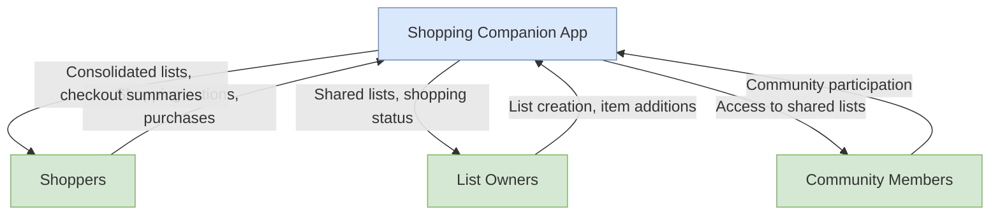
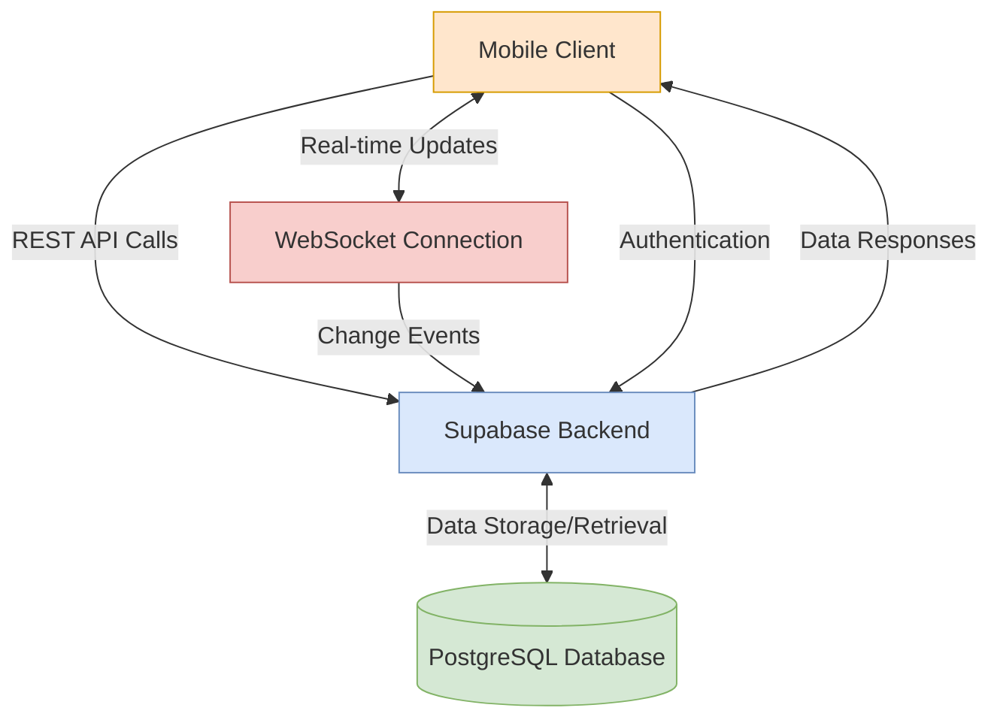
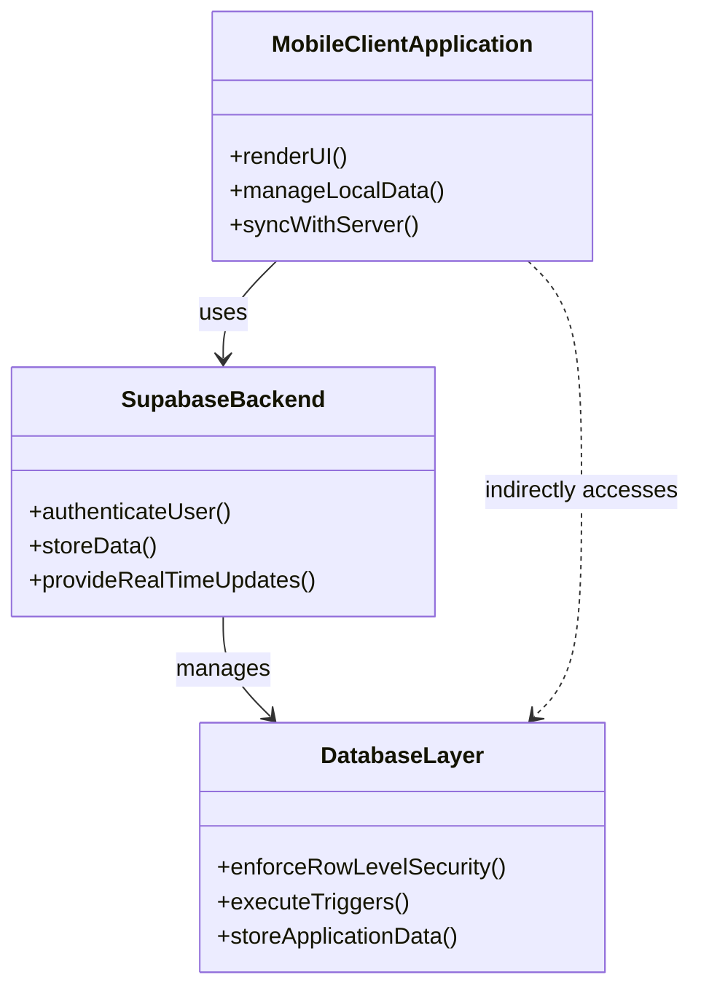
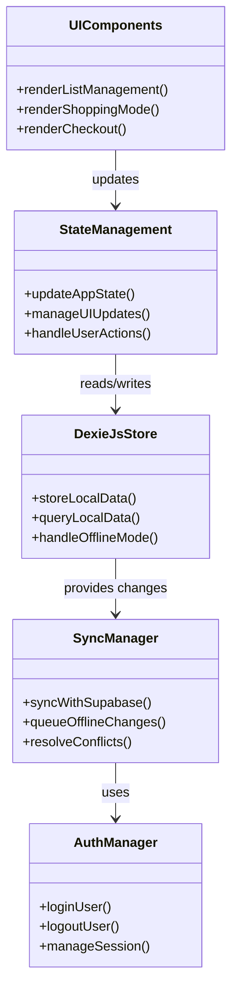
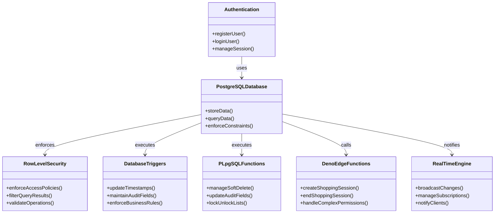
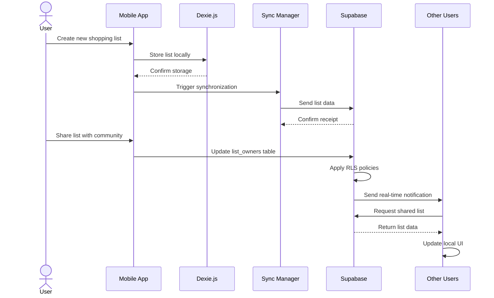
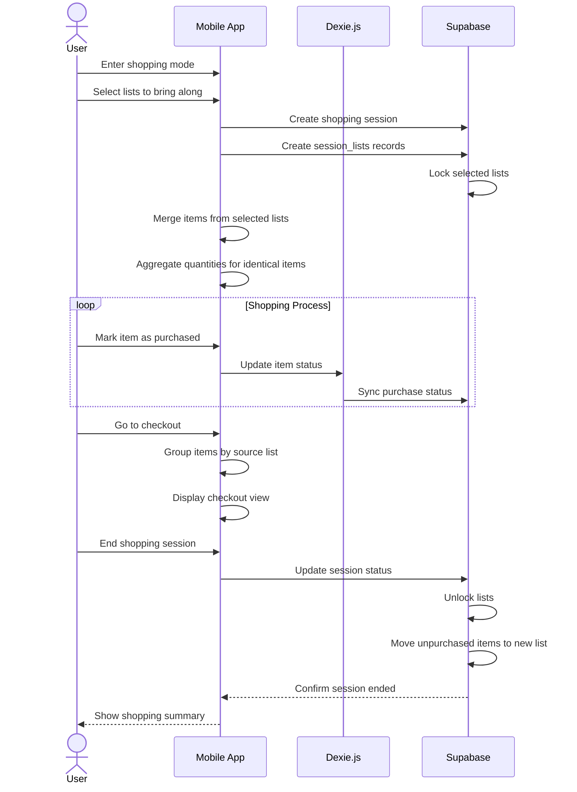
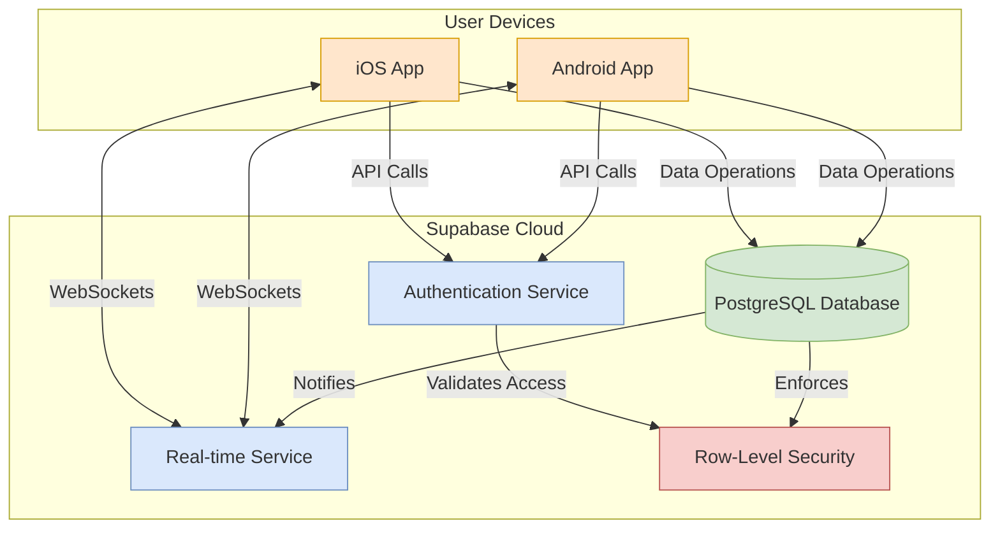

# Shopping Companion App - Architecture Documentation

**Based on arc42 Template Version 8.2 EN**

# Introduction and Goals

The Shopping Companion App is a mobile application designed to facilitate collaborative grocery shopping among friends, family members, and communities. It allows multiple users to create and share shopping lists, with one person efficiently shopping for multiple people by consolidating shopping lists.

## Requirements Overview

The core requirements of the Shopping Companion App are:

* Multiple persons can edit the same shopping list if they are owners of the list
* People within the same community can share their shopping lists with the group
* While shopping, users can select shared shopping lists to bring along, with items merged into one consolidated list
* At checkout, the application groups shopped items by source list for easy packing into separate bags
* Lists are locked during shopping to prevent concurrent modifications

For detailed requirements, see the [Product Design Document](./ShoppingApp_PDD.md).

## Quality Goals

| Priority | Quality Goal | Motivation |
|----------|--------------|------------|
| 1 | Usability | The app must be intuitive and easy to use during shopping |
| 2 | Reliability | Shopping lists must be available even with intermittent connectivity |
| 3 | Performance | The app must respond quickly, especially during the shopping process |
| 4 | Data Integrity | Shopping lists must maintain consistency across multiple users |
| 5 | Scalability | The system should handle growing numbers of users and communities |

## Stakeholders

| Role | Expectations |
|------|--------------|
| Shoppers | Efficient way to shop for multiple people; clear organization of items by source list |
| List Creators | Easy creation and sharing of shopping lists; confidence that lists won't be modified during shopping |
| Community Admins | Simple management of community members and shared lists |
| Developers | Clear architecture and documentation; maintainable codebase |

# Architecture Constraints

| Constraint | Description |
|------------|-------------|
| Mobile Platform | The application must function on mobile devices |
| Offline Capability | Core functionality must work without constant internet connection |
| Backend Technology | Supabase will be used as the backend service |
| Client-side Storage | Dexie.js will be used for local-first caching |
| Data Synchronization | Lazy synchronization between client and server |
| Conflict Resolution | "Last edit wins" approach for simplicity in the initial version |

# Context and Scope

## Business Context

The Shopping Companion App interacts with the following external entities:

| External Entity | Input | Output |
|-----------------|-------|--------|
| Shoppers | Shopping actions, item purchases | Consolidated shopping lists, checkout summaries |
| List Owners | List creation, item additions | Shared lists, shopping status |
| Community Members | Community participation | Access to shared lists |

## Technical Context

| Component | Description |
|-----------|-------------|
| Mobile Client | React Native or Flutter application with Dexie.js for local storage |
| Supabase Backend | Provides authentication, database, and real-time updates |
| PostgreSQL Database | Stores all application data with row-level security |
| WebSocket Connection | Enables real-time updates between clients |

# Solution Strategy

The Shopping Companion App follows these key strategic decisions:

1. **Local-First Architecture**: Using Dexie.js for client-side storage to enable offline functionality
2. **Real-Time Synchronization**: Leveraging Supabase's real-time capabilities for collaborative features
3. **Relational Data Model**: Using a structured relational model to maintain data integrity
4. **Soft Delete**: Implementing soft deletion throughout the application for data recovery
5. **Row-Level Security**: Using Supabase RLS policies to enforce access controls at the database level
6. **Last-Edit-Wins Conflict Resolution**: Simplifying synchronization with timestamp-based resolution
7. **Server-Side Business Logic**: Implementing all data consistency logic within Supabase:
   - PL/pgSQL functions for simpler operations (timestamps, soft delete, list locking)
   - Deno Edge Functions for complex operations (shopping sessions, multi-table operations)

# Building Block View

## Whitebox Overall System

The Shopping Companion App consists of these main building blocks:

### Mobile Client Application

**Responsibility**: Provides the user interface and local data management.

**Interfaces**:
- User Interface for list management and shopping
- Local database interface (Dexie.js)
- Supabase client API for server synchronization

### Supabase Backend

**Responsibility**: Provides authentication, database storage, and real-time updates.

**Interfaces**:
- REST API for CRUD operations
- Real-time subscription API
- Authentication endpoints

### Database Layer

**Responsibility**: Stores all application data with appropriate security policies.

For detailed information about the data model, see the [Data Model Documentation](./ShoppingApp_DataModel.md).

## Level 2

### White Box Mobile Client

| Component | Responsibility |
|-----------|----------------|
| UI Components | Render the user interface for list management and shopping |
| State Management | Manage application state and UI updates |
| Dexie.js Store | Provide local-first data storage and caching |
| Sync Manager | Handle synchronization with Supabase backend |
| Auth Manager | Manage user authentication and session |

### White Box Supabase Backend

| Component | Responsibility |
|-----------|----------------|
| Authentication | Handle user registration, login, and session management |
| PostgreSQL Database | Store application data with row-level security |
| Real-time Engine | Provide WebSocket-based real-time updates |
| Row-Level Security | Enforce access control policies |
| Database Triggers | Maintain audit fields and enforce business rules |
| PL/pgSQL Functions | Handle simple business logic operations |
| Deno Edge Functions | Handle complex multi-table operations |

# Runtime View

## User Creates and Shares a Shopping List

## User Goes Shopping

# Deployment View

## Infrastructure Level 1

| Component | Technology |
|-----------|------------|
| Mobile Client | iOS and Android native apps |
| Backend Services | Supabase Cloud |
| Database | PostgreSQL on Supabase |
| Authentication | Supabase Auth |
| Real-time Communication | Supabase Realtime (WebSockets) |

# Cross-cutting Concepts

## Offline Functionality

The application uses a local-first approach with Dexie.js to ensure core functionality works without an internet connection:
- Users can create and modify shopping lists offline
- Shopping can be conducted without connectivity
- Data synchronizes when connectivity is restored

## Data Synchronization

- Client-side changes are stored locally first
- Changes are synchronized lazily to the server
- Conflicts are resolved using the "last edit wins" strategy based on timestamps
- Future versions may implement more sophisticated conflict resolution

## Security Concept

- Authentication is handled by Supabase Auth
- Row-Level Security (RLS) policies control data access
- Lists are only accessible to owners and community members with appropriate permissions
- Soft deletion preserves data for potential recovery

## Audit Trail

- All tables include created_at, updated_at, and last_modified_at fields
- Database triggers automatically maintain these fields
- Soft deletion (deleted_at) is used throughout the application

# Architecture Decisions

| Decision | Rationale |
|----------|-----------|
| Use Supabase as backend | Provides authentication, database, and real-time capabilities in one platform |
| Implement local-first with Dexie.js | Ensures offline functionality and improves performance |
| Use soft delete | Prevents accidental data loss and enables recovery |
| Adopt "last edit wins" conflict resolution | Simplifies initial implementation while allowing for future enhancement |
| Use UUIDs as primary keys | Enables distributed ID generation and prevents conflicts during offline use |

# Quality Requirements

## Quality Tree

```mermaid
graph TD
    Quality[Quality]
    
    Usability[Usability]
    Reliability[Reliability]
    Performance[Performance]
    DataIntegrity[Data Integrity]
    Scalability[Scalability]
    
    IntuitiveUI[Intuitive UI]
    EasyNavigation[Easy Navigation]
    OfflineCapability[Offline Capability]
    DataConsistency[Data Consistency]
    ResponseTime[Response Time]
    LoadTime[Load Time]
    DataAccuracy[Data Accuracy]
    ConcurrentEditing[Concurrent Editing]
    UserGrowth[User Growth]
    DataVolume[Data Volume]
    
    Quality --> Usability
    Quality --> Reliability
    Quality --> Performance
    Quality --> DataIntegrity
    Quality --> Scalability
    
    Usability --> IntuitiveUI
    Usability --> EasyNavigation
    
    Reliability --> OfflineCapability
    Reliability --> DataConsistency
    
    Performance --> ResponseTime
    Performance --> LoadTime
    
    DataIntegrity --> DataAccuracy
    DataIntegrity --> ConcurrentEditing
    
    Scalability --> UserGrowth
    Scalability --> DataVolume
    
    classDef root fill:#f9f,stroke:#333,stroke-width:2px
    classDef primary fill:#bbf,stroke:#33f,stroke-width:1px
    classDef secondary fill:#ddf,stroke:#33f,stroke-width:1px
    
    class Quality root
    class Usability,Reliability,Performance,DataIntegrity,Scalability primary
    class IntuitiveUI,EasyNavigation,OfflineCapability,DataConsistency,ResponseTime,LoadTime,DataAccuracy,ConcurrentEditing,UserGrowth,DataVolume secondary
```

## Quality Scenarios

| Scenario | Quality Attribute | Description |
|----------|-------------------|-------------|
| Offline Shopping | Reliability | User can shop with no internet connection and data syncs when connection is restored |
| Concurrent Editing | Data Integrity | Two users edit different items on the same list simultaneously without conflicts |
| List Locking | Consistency | When a user shops with a list, others cannot modify it until shopping is complete |
| Large Community | Scalability | System performs well with communities of 100+ members and 50+ concurrent active users |
| First-time Use | Usability | New user can create a list and start shopping within 5 minutes without help |

# Risks and Technical Debts

| Risk/Debt | Description | Mitigation |
|-----------|-------------|------------|
| Conflict Resolution | Current "last edit wins" approach may lead to data loss in complex scenarios | Plan for more sophisticated conflict resolution in future versions |
| Offline Duration | Extended offline use might lead to complex merge scenarios | Implement better conflict visualization and resolution UI |
| Real-time Performance | Large numbers of concurrent users might stress the real-time system | Monitor performance and implement throttling if needed |
| Data Migration | Schema evolution will require careful migration planning | Design migrations with backward compatibility in mind |

# Glossary

| Term | Definition |
|------|------------|
| Shopping List | A collection of items that need to be purchased |
| Community | A group of users who can share shopping lists |
| List Owner | A user who has full edit rights to a shopping list |
| Shopping Session | A period when a user is actively shopping with selected lists |
| Soft Delete | Marking records as deleted without physically removing them from the database |
